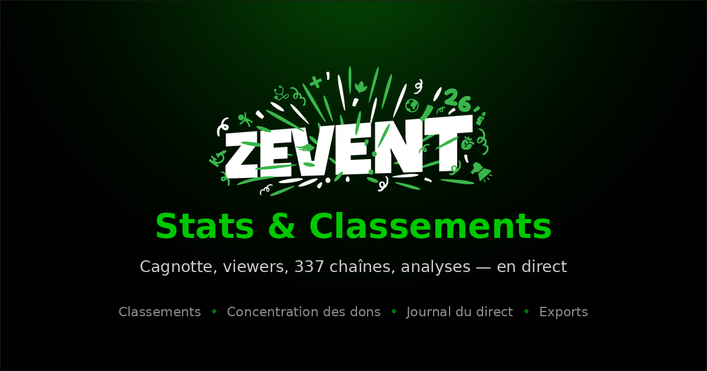

# ZEVENT 2026 — Stats & Classements

Tableau de bord **non officiel** du ZEVENT 2026, en une seule page HTML. Cagnotte, audience, classements des chaînes et analyses de répartition, mis à jour en direct depuis l'API publique de l'événement.

**→ [mifu999.github.io/zevent-stats](https://mifu999.github.io/zevent-stats/)**



---

## Ce qu'on y trouve

**Cagnotte en direct** — compteur animé aux centimes, courbe de progression de la session, vitesse de collecte mesurée en euros par minute et par heure.

**Résumé chiffré** — 18 indicateurs : total, part attribuée aux chaînes contre part versée sur la cagnotte globale, audience cumulée, répartition entre les streamers sur place et à distance, moyennes et médianes.

**Classements** — podium et places 1 à 40, sur cinq critères : dons, viewers, euros par viewer, dons sur place, dons à distance. Plus les chaînes ayant le plus progressé depuis l'ouverture de la page.

**Tous les streamers** — la liste complète renvoyée par l'API, avec recherche, filtres (lieu, statut, jeu), sept tris, vue grille ou tableau triable, et une fiche détaillée par chaîne (rangs, part de cagnotte, écarts à la moyenne et à la médiane, identifiants, liens).

**Analyses de répartition** — courbe de Lorenz et indice de Gini, seuils de Pareto (combien de chaînes pour atteindre 50, 80 ou 90 % de la cagnotte), nuage de points audience contre dons en échelles logarithmiques avec droite de régression, corrélations de Pearson et Spearman, histogrammes, quartiles et boîte à moustaches.

**Jeux diffusés** — répartition par catégorie, avec l'audience et les dons cumulés de chacune.

**Journal du direct** — passages en live, arrêts de stream, changements de jeu et sauts de collecte détectés entre deux actualisations.

**Exports** — CSV des streamers avec les colonnes calculées, JSON complet de l'instantané, CSV de l'historique de session, résumé texte à copier.

---

## Installation

Le dépôt tient en quatre fichiers. Il n'y a rien à compiler, aucune dépendance à installer.

```
index.html      la page complète (HTML, CSS et JavaScript dans un seul fichier)
worker.js       relais CORS optionnel à déployer sur Cloudflare Workers
favicon.svg     icône
og-image.png    image affichée lors du partage du lien
.nojekyll       désactive le traitement Jekyll de GitHub Pages
```

Pour publier : dans **Settings → Pages**, choisissez la branche `main` et le dossier `/ (root)`. La page est en ligne une minute plus tard.

Elle fonctionne aussi en ouvrant `index.html` directement depuis le disque, avec une réserve expliquée juste en dessous.

---

## Comment les données sont récupérées

La page interroge `https://zevent.fr/api/`, l'API publique qui alimente le site officiel. Aucune valeur n'est simulée ni complétée : tout ce qui s'affiche est soit un champ brut de l'API, soit un calcul explicite sur ces champs.

### La difficulté : l'API n'autorise pas les appels externes

L'API ne renvoie pas d'en-tête `Access-Control-Allow-Origin`. Un navigateur bloque donc tout appel venant d'une autre page que le site officiel, qu'elle soit hébergée sur GitHub Pages ou ouverte depuis un fichier local. Ce n'est pas contournable côté client.

La page lance donc **huit sources en parallèle** à chaque actualisation et retient la première réponse exploitable. Une source lente, saturée ou bloquée ne pénalise plus les autres : la réponse arrive en général en moins d'une seconde.

Voici ce que donnent ces sources selon le contexte, mesuré depuis un navigateur :

| Source | Fichier local | Site hébergé |
|---|---|---|
| `proxy.cors.sh` | fonctionne (~400 ms) | fonctionne (~170 ms) |
| `r.jina.ai` | fonctionne (~410 ms) | fonctionne (~525 ms), 401 par moments |
| `proxy.corsfix.com` | refusé | 403 sans origine déclarée |
| Appel direct | bloqué | bloqué |
| `cors.lol`, `allorigins`, `codetabs` | intermittents | intermittents |

Héberger la page sur GitHub Pages donne donc **une source de plus** que l'ouvrir depuis le disque. C'est le mode d'emploi recommandé.

Ces relais sont des services publics gratuits : ils peuvent limiter le nombre de requêtes ou tomber. C'est la raison d'être des huit sources simultanées, du relais personnalisé et du mode manuel décrits plus bas.

### Si plus rien ne répond

Un encadré apparaît alors en haut de page avec trois solutions :

1. **Relais personnalisé** — dans la section « Données », indiquez votre propre relais. Utilisez `{url}` pour l'adresse encodée ou `{raw}` pour l'adresse telle quelle, par exemple `https://mon-relais.exemple/?target={url}`. Attention : ce réglage est enregistré dans votre navigateur et ne bénéficie donc qu'à vous. Pour couvrir tous les visiteurs, voir la section « Relais dédié » ci-dessous.
2. **Collage manuel** — ouvrez `https://zevent.fr/api/` dans un onglet, `Ctrl+A` puis `Ctrl+C`, revenez sur la page et cliquez sur « Coller depuis le presse-papier ». Le chargement d'un fichier `.json` est également possible.
3. **Instantané conservé** — la dernière lecture réussie est enregistrée dans le navigateur. Au rechargement, la page s'affiche immédiatement avec ces données, signalées comme figées, pendant qu'elle retente le réseau.

La section « Données » liste en permanence chaque source avec son état exact : réussie en tant de millisecondes, échec avec son motif, ou annulée.

---

## Relais dédié (recommandé)

Les relais publics sont gratuits mais saturent ou disparaissent sans prévenir : au cours d'une seule journée de test, `cors.lol` a cessé de répondre entre deux essais espacés d'une minute. Un relais à vous supprime cette dépendance, et il reste gratuit.

Le fichier `worker.js` du dépôt contient un Cloudflare Worker d'une trentaine de lignes qui recopie l'API en y ajoutant les en-têtes CORS manquants. Le plan gratuit offre **100 000 requêtes par jour, sans carte bancaire, sans expiration**, et autorise l'usage commercial.

### Mise en place

1. Créez un compte sur [dash.cloudflare.com](https://dash.cloudflare.com) — aucun domaine ni moyen de paiement n'est demandé.
2. Dans le menu latéral, ouvrez la section **Workers** (parfois nommée « Compute » ou « Workers & Pages »), puis créez un Worker à partir du modèle de démarrage.
3. Donnez-lui un nom, par exemple `zevent-api`, et déployez-le tel quel.
4. Ouvrez l'éditeur de code du Worker, remplacez tout son contenu par celui de `worker.js`, puis redéployez.
5. Notez l'adresse obtenue, de la forme `https://zevent-api.VOTRE-COMPTE.workers.dev`. Ouvrez-la dans un onglet : vous devez voir le JSON de l'API.
6. Dans `index.html`, cherchez la ligne `const WORKER_URL = '';` près du début du script et collez-y cette adresse. Poussez le fichier.

Le relais dédié passe alors en tête de la course pour **tous les visiteurs**, sans qu'ils aient quoi que ce soit à configurer. Laissé vide, il est simplement ignoré.

### Ce que ça consomme

Le Worker met la réponse en cache 15 secondes côté Cloudflare : mille visiteurs simultanés ne déclenchent que quatre appels par minute vers `zevent.fr`. Le quota se calcule en revanche sur les appels reçus par le Worker.

Avec une actualisation toutes les 20 secondes, un visiteur consomme 180 requêtes par heure. Les 100 000 quotidiennes couvrent donc environ **550 heures de consultation cumulées par jour**, soit une vingtaine de personnes qui laisseraient la page ouverte en continu. Pour un pic d'audience, passer l'actualisation par défaut à 30 ou 60 secondes divise d'autant la consommation.

Et si le quota est atteint, rien ne casse : le Worker renvoie une erreur, la course bascule sur les relais publics et la page continue de fonctionner.

---

## Réglages

**Fréquence d'actualisation** — 10, 20, 30 ou 60 secondes, ou manuelle. L'API sert un cache de 15 secondes, en dessous de quoi les requêtes supplémentaires n'apportent rien. Le rafraîchissement se met en pause quand l'onglet passe en arrière-plan et repart au retour.

**Source** — laisser sur « toutes les sources en parallèle », sauf pour diagnostiquer un relais en particulier.

Les préférences et le dernier instantané sont conservés dans le stockage local du navigateur. Rien n'est envoyé ailleurs : il n'y a ni serveur, ni compte, ni traçage.

---

## Ce que la page ne peut pas faire

L'API **ne publie aucun historique**. Les courbes de session, la vitesse de collecte et la liste des progressions se construisent uniquement pendant que la page reste ouverte. Elles sont vides au démarrage, et repartent de zéro à chaque rechargement — c'est indiqué explicitement plutôt que comblé par des valeurs inventées.

Les extrapolations de rythme de collecte sont des projections linéaires calculées sur cette seule durée d'observation. Ce ne sont pas des prévisions et rien ne permet de les valider.

Les dons sont cumulés depuis le début de l'événement alors que les viewers sont un instantané. Toute comparaison entre les deux, y compris le ratio euros par viewer, porte cette limite.

---

## Technique

Un seul fichier, sans dépendance ni build. Tous les graphiques sont du SVG généré en JavaScript. Le logo est intégré en base64, seule la police [Switzer](https://www.fontshare.com/fonts/switzer) est chargée depuis Fontshare, avec repli sur la police système.

La charte reprend celle du site officiel : fond noir, vert `#00BD00` et sa rampe, boutons à dégradé vertical et double ombre interne, cartes `#080808` bordées de `#1D1D1D`.

Accessibilité : navigation au clavier, focus visible, contrastes conformes, tableaux et graphiques doublés de valeurs textuelles, `prefers-reduced-motion` respecté. Responsive jusqu'à 380 px de large.

---

## Mentions

Projet personnel **sans aucune affiliation** avec le ZEVENT, ses organisateurs, les streamers participants ou les associations soutenues. Le logo et l'icône appartiennent au ZEVENT et ne sont repris qu'à des fins d'illustration. Les avatars sont servis par le CDN de Twitch.

Pour faire un don, passez par le site officiel : **[zevent.fr/don](https://zevent.fr/don)**.

---

## Crédits

Page de stats conçue et développée par **[Mifu](https://github.com/Mifu999)**.

Données fournies par l'[API publique du ZEVENT](https://zevent.fr/api/).
